# Sequence Diagrams

## Indian Stock Market Prediction System

Diagrams use [Mermaid](https://mermaid.js.org/) syntax and render natively in GitHub, GitLab, and most Markdown viewers.

---

## 1. `shortlist` — Buy / Short / Trending Discovery

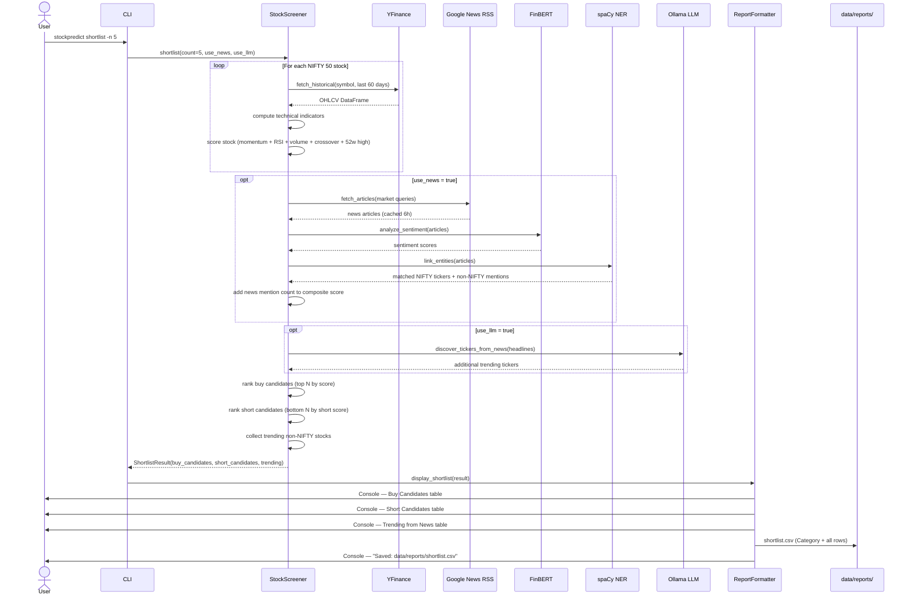

---

## 2. `suggest` — Ranked Momentum Watchlist

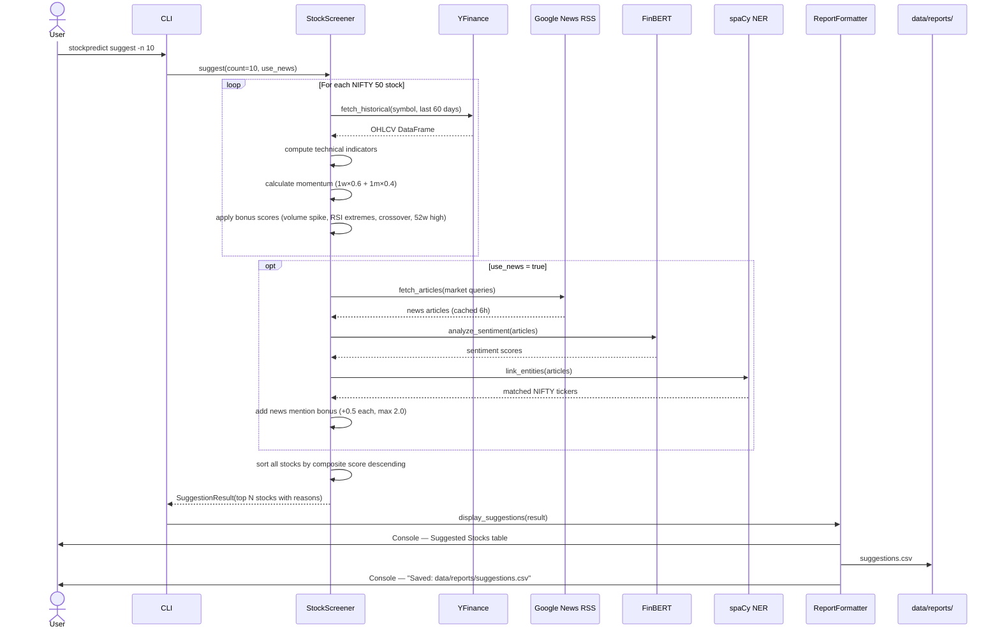

---

## 3. `fetch-data` — Data Preview / Connectivity Check

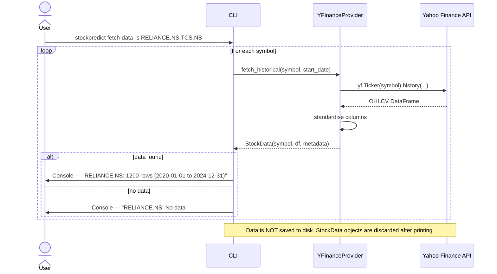

---

## 4. `train` — Train LSTM + XGBoost Ensemble

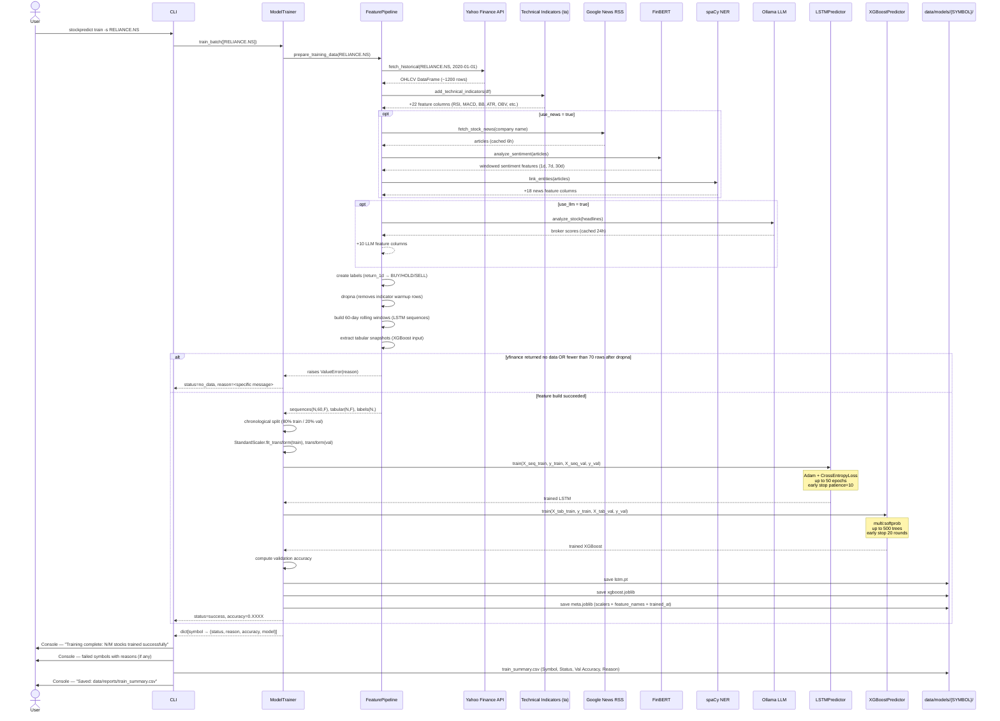

---

## 5. `predict` — Generate Trading Signals

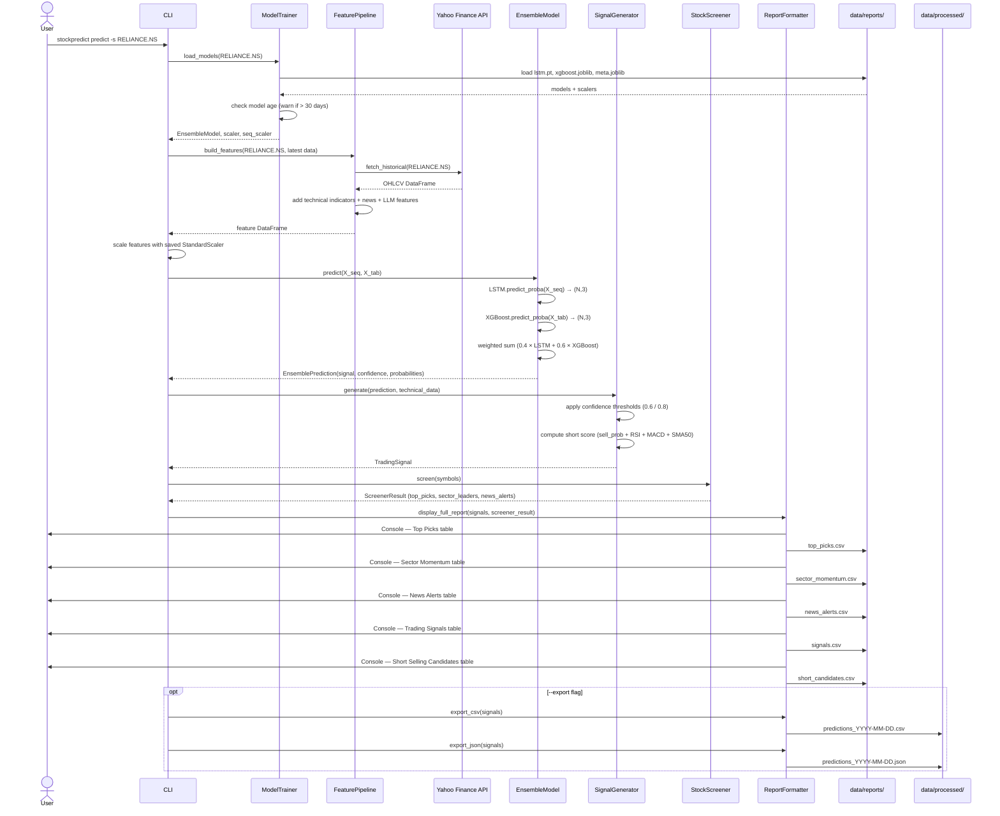

---

## 6. `analyze` — Deep Single-Stock Analysis

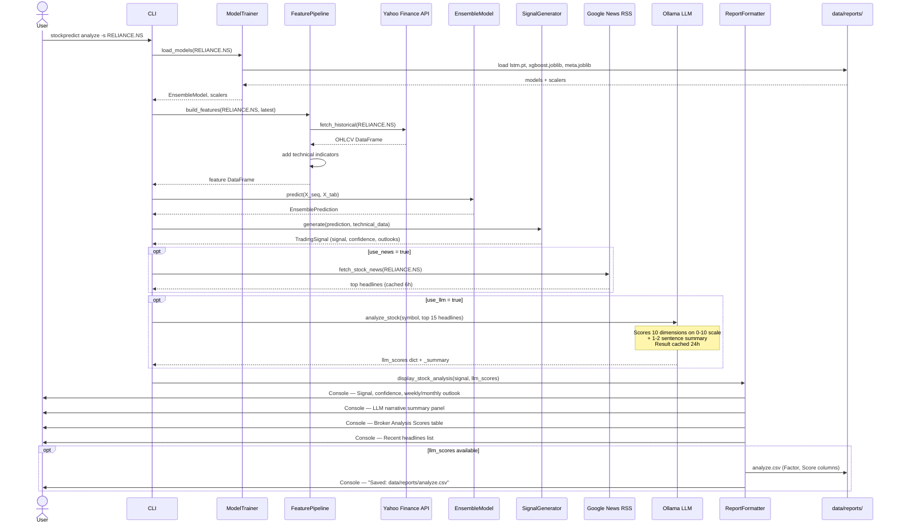

---

## 7. `screen` — Full Stock Screener

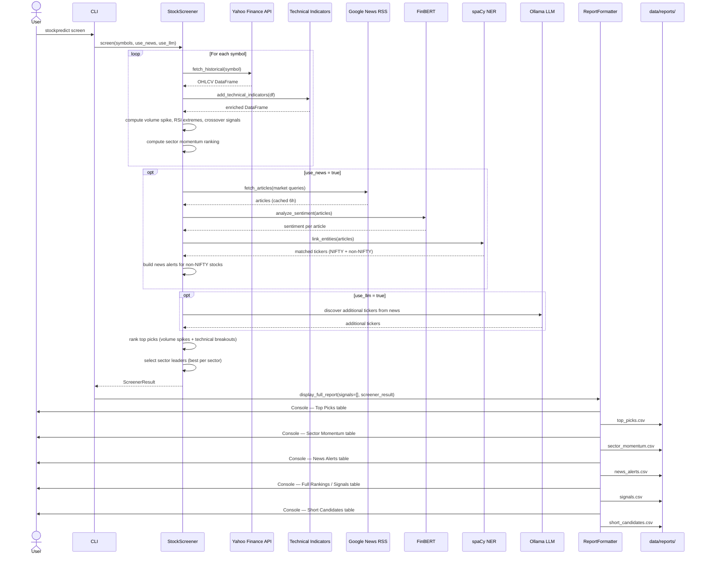

---

## 8. Paper Trading Flow

### 8a. `test-buy` / `test-short` — Open a Position

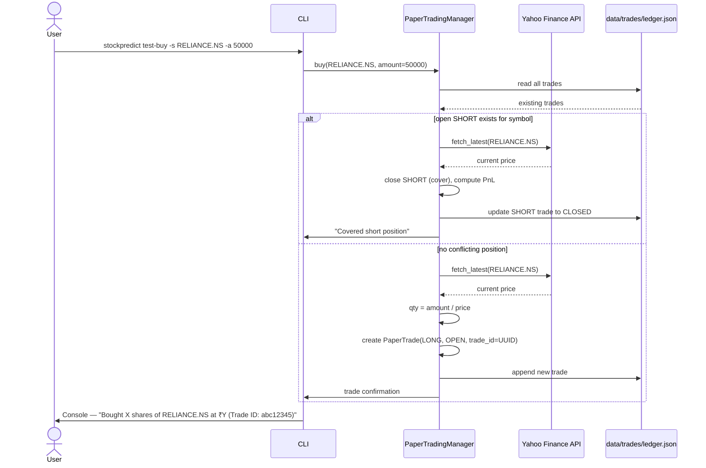

---

### 8b. `test-sell` — Close a Position

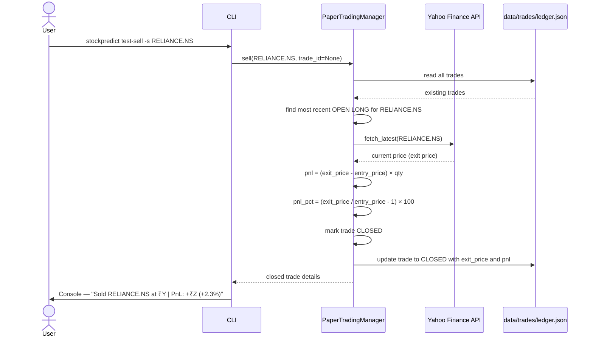

---

### 8c. `test-portfolio` — View Open Positions

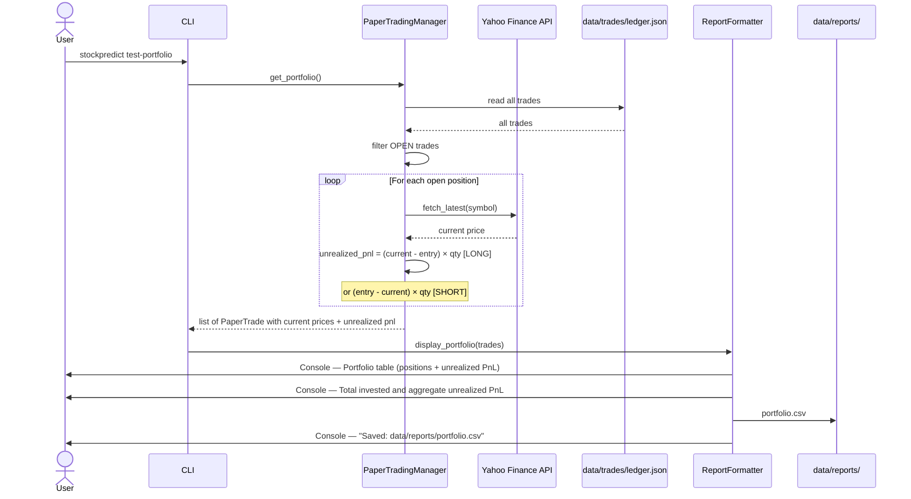

---

### 8d. `test-calculate-gain` — Gain / Loss Report

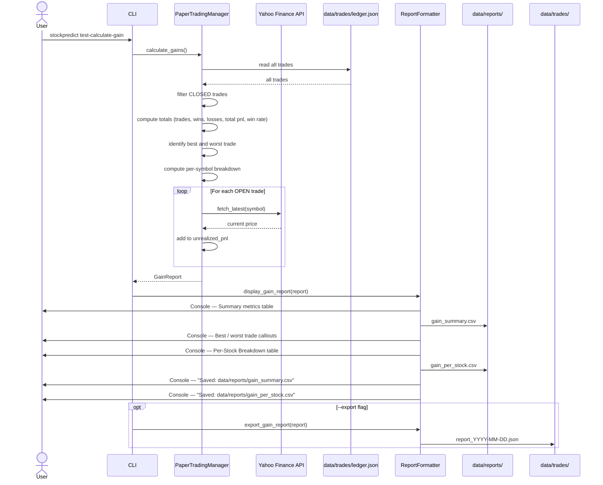
